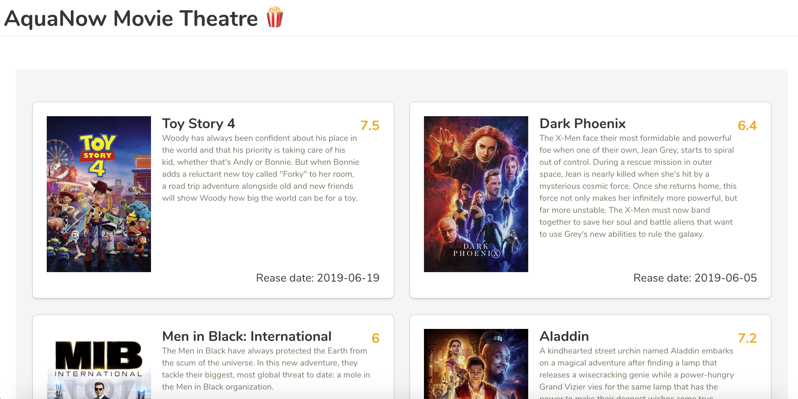
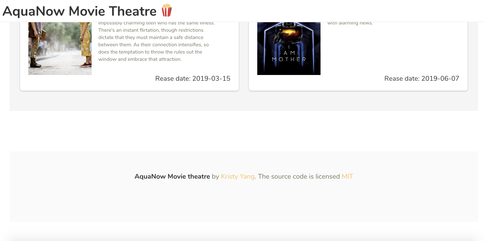

# AquaNow Movie Theatre

- [AquaNow Movie Theatre](#AquaNow-Movie-Theatre)
  - [Website Snapshots](#Website-Snapshots)
  - [Group Members](#Group-Members)
  - [Project Description](#Project-Description)
    - [Who is it for?](#Who-is-it-for)
    - [What will it do?](#What-will-it-do)
  - [Testing Cases](#Testing-Cases)
    - [Unit Test](#)


## Website Snapshots



### End of pages



## Group Members

- Kristy Yang ([@kristyyang](https://github.com/kristyyang))

## Project Setup

Before you setup this project, make sure you already have [yarn](https://yarnpkg.com/en/) installed.

```bash
git clone https://github.com/kristyyang/Movies
cd Movies
yarn install
yarn start
```

Open you browser and visit `localhost:3000`.

## Project Description

### Who is it for?

The project we are aiming to build is a online info board for users who are interested in watching movies and want to gathering information about related movies.

### What will it do?

We will be presenting a list of tables of movies, it will represent moveies post and information, rating and movie descriptions.

## Testing Cases

####  Jest or Enzyme used for testing React apps

- Jest is JavaScript testing framework used to test JavaScript apps

- Enzyme is a JavaScript testing utility for React that makes it easier to assert,  manipulate, and traverse your React Components’ output.

### Unit Tests

Unit tests for the display component are pretty easy.

### Test case 1: Rating color

- Make sure rating correspond to right color

```
- If movie rate is below 5, number should be display in red
- If movie rate is between 5 and 8, number should be display yellow
- If movie rate is above 8, number should be green
```

### Test case 2: Navbar component

- Make sure Navbar component

```
- Given no arguments: should give the correct theatre name. (AquaNow movie theatre)
```

### Test case 3: Content component

- We can use react-testing-library testing library to test React Hooks.
